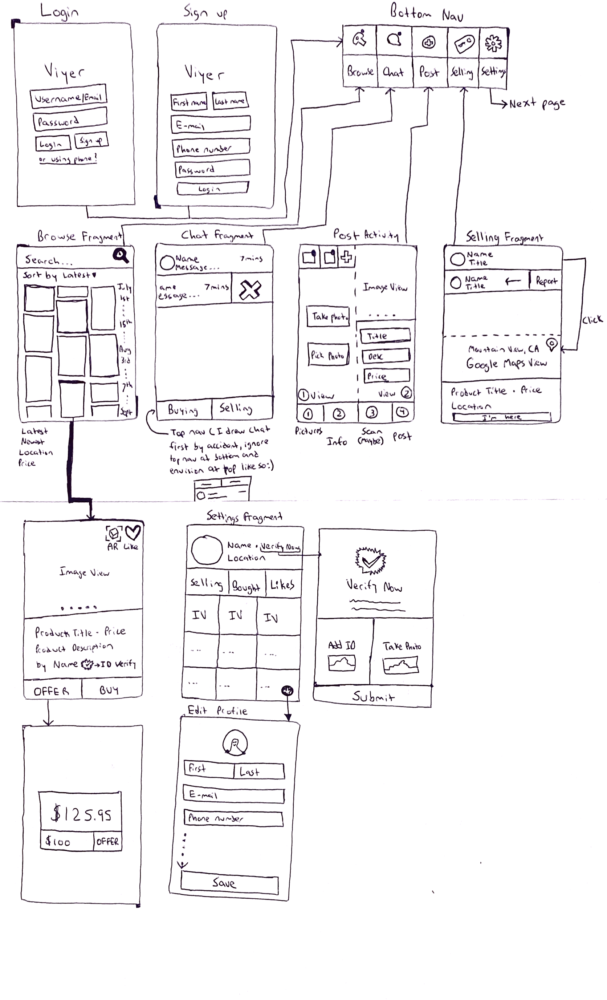

Original App Design Project - README
===

# Name - Viyer

## Table of Contents
1. [Overview](#Overview)
1. [Product Spec](#Product-Spec)
1. [Wireframes](#Wireframes)
2. [Schema](#Schema)

## Overview
### Description
Marketplace app to sell used/new items with AR functionality to increase selling rate since buyers can visualize the item before meeting up. Security features is a major focus with features such as both parties press "I'm here" when meeting up and required ID verification.

### App Evaluation

- **Category:** Marketplace
- **Mobile:** All of the functionality lies within the app, and is compatible with a smart phone, tablet or other compatible device.
- **Story:** Removes the uncertainty when it comes to buying things online. Craigslist did not take security into consideration which led to less sales, prioritizing the user experience.
- **Market:** Anyone looking to get rid of old items and those looking for a good deal
- **Habit:** Since everyone is looking for a discount on new/old items, I'd imagine users looking through the app often to find deals forming a habit.
- **Scope:** V1 would allow sellers to post items and buyers to view the description of said items. V2 would incorpate Google Cloud Vision API to automatically verify someones identity with their ID. V3 adds AR technology allowing sellers to scan their items and buyers being able to view them.

## Product Spec

### 1. User Stories (Required and Optional)

**Required Must-have Stories**

* Your app has multiple views
* Your app interacts with a database (e.g. Parse)
* You can log in/log out of your app as a user
* You can sign up with a new user profile
* Somewhere in your app you can use the camera to take a picture and do something with the picture (e.g. take a photo and share it to a feed, or take a photo and set a user’s profile picture)
* Your app integrates with a SDK (e.g. Google Maps SDK, Facebook SDK)
* Your app contains at least one more complex algorithm (talk over this with your manager)
* Your app uses gesture recognizers (e.g. double tap to like, e.g. pinch to scale)
* Your app use an animation (doesn’t have to be fancy) (e.g. fade in/out, e.g. animating a view growing and shrinking)
* Your app incorporates an external library to add visual polish

**Optional Nice-to-have Stories**

* Instant identity verification given a user photo and government issued ID
* AR Object Scanning
* Paid front page ads
* Phone number login
* Live chat
* Material-UI Integration (for external library to add visual polish)

### 2. Screen Archetypes

* Login screen
   * User can login
* Registration screen
   * User can enter their number to recieve a verification code
* Browse screen
   * User can vertically scroll throw products
* Post screen
   * User can post pictures with a description, price, and optionally scan their item for to be displayed using AR
* Settings screen
   * User can verify their identity
   * User can change their name
* Chat screen
   * User can chat with other sellers/buyers
* Product screen
   * User can view product listings
* Verification screen
   * User can upload picture and ID

### 3. Navigation

**Tab Navigation** (Tab to Screen)

* Browse screen
* Chat screen
* List item screen
* Security screen

**Flow Navigation** (Screen to Screen)

* Login screen
   => Browse screen
* Registration screen
   => Browse screen
* Post screen
   => Product screen
   => Browse screen
* Product screen
   => Chat screen
   => Browse screen
* Security screen
   => Verification screen
* Profile screen
   => Browse screen

## Wireframes

**Initial wireframe**


**Basic wireframe**


**Final wireframe**



## Schema
### Models
#### Post

   | Property      | Type     | Description |
   | ------------- | -------- | ------------|
   | objectId      | String   | unique id for the user post (default field) |
   | user          | Pointer to User | image user |
   | images        | Array    | images that user posts |
   | title         | String   | product title by user |
   | caption       | String   | product caption by user |
   | price         | int      | product price by user |
   | createdAt     | DateTime | date when post is created (default field) |
   | updatedAt     | DateTime | date when post is last updated (default field) |

#### User

   | Property      | Type     | Description |
   | ------------- | -------- | ------------|
   | objectId      | String   | unique id for the user post (default field) |
   | emailVerified | Boolean  | boolean that shows if a user email is verified |
   | email         | String   | email of user |
   | username      | String   | username of user |
   | password      | String   | password of user |
   | phoneNumber   | String   | phone number of user |
   | profileImage  | File     | profile image of user |
   | idImage       | File     | government ID of user |
   | idVerified    | Boolean  | boolean that shows if a user has identification verified |
   | createdAt     | DateTime | date when post is created (default field) |
   | updatedAt     | DateTime | date when post is last updated (default field) |

#### Chatroom

   | Property      | Type     | Description |
   | ------------- | -------- | ------------|
   | objectId      | String   | unique id for the user post (default field) |
   | name          | String   | name of chatroom |
   | createdAt     | DateTime | date when post is created (default field) |

#### Message

   | Property      | Type     | Description |
   | ------------- | -------- | ------------|
   | objectId      | String   | unique id for the user post (default field) |
   | chatroom      | Pointer to Chatroom  | chatroom |
   | user          | Pointer to User      | user |
   | message       | String   | message of user |
   | createdAt     | DateTime | date when post is created (default field) |

### Networking
#### List of network requests by screen
##### Note: Since I am going to use Firebase, I have yet to research the exact code for queries. Below is a query using Parse.
   - Home Feed Screen
      - (Read/GET) Query all products
         ```java
          protected void queryPosts() {
          ParseQuery<Post> query = ParseQuery.getQuery(Post.class);
          query.include(Post.KEY_USER);
          query.whereEqualTo(Post.KEY_USER, ParseUser.getCurrentUser());
          query.setLimit(20);
          query.addDescendingOrder(Post.KEY_CREATED_AT);
          query.findInBackground(new FindCallback<Post>() {
            @Override
            public void done(List<Post> posts, ParseException e) {
                if (e != null) {
                  Log.e(TAG, "Issue with getting posts", e);
                  return;
                }

                allPosts.addAll(posts);
                adapter.notifyDataSetChanged();
              }
            });
          }
         ```
   - Create Product Screen
      - (Create/POST) Create a new product object
   - Product Screen
       - (Update/PUT) Like a product
   - Chat Screen
       - (Read/GET) Query messages from chatroom
       - (Create/POST) Create a new message in a chatroom
   - Verification Screen
       - (Read/GET) Get response from Google Cloud Vision API
       - (Create/POST) Create a image
   - Profile Screen
      - (Read/GET) Query logged in user object
      - (Update/PUT) Update user profile image
   - Login Screen
      - (Create/POST) Create a user
      - (Read/GET) Query user for authentication

 #### [OPTIONAL:] Existing API Endpoints
 ##### No known API endpoints needed for app, will update if required. Below is a template that I will fill out.
- Base URL - [http://www.facebook.com/api](http://www.facebook.com/api)

   Example HTTP Verb | Example Endpoint | Example Description
   ----------|----------|------------
    `GET`    | /characters | get all characters
    `GET`    | /characters/?name=name | return specific character by name
    `GET`    | /houses   | get all houses
    `GET`    | /houses/?name=name | return specific house by name
